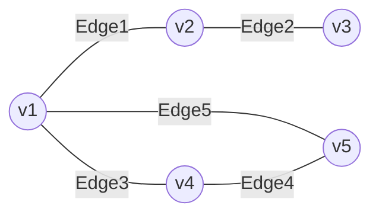

# Analysis of Algorithms

<!-- Notes maintained by: Dibakash Baruah -->

## What are we interested in when we are computing the performance of an Algorithm?

---

### Two main resources of Interest:

- Running time - how much time the Algorithm takes
- Space - memory requirements

### Time depends on Processing Power -

- Impossible to change the running time for a given hardware
- Based on the present computing power of the CPUs ( last 10 / 15 years [this is 2022] ), Python can do around $10^7$ operations/ second.
- Enhancing hardware has only a limited impact at a practical level
- Meaning, even if we upgrade to a machine that is 10 times faster would not have any significant impact on something which is inherently long to compute.

### Storage is limited by Available Memory

- Easier to configure, augment

Because of this reason, when we talk about performance the focus is more on the time rather than space aspect of performance

<br>

### Input Size

---

- Running time depends on input size. For example, a larger array takes more time to sort than a smaller array. We can think of time efficiency as a function of input size $n$ as running time $t(n)$
- Of course, different inputs of the same input size $n$ may take different amounts of time. For example, two arrays of the same size may take different amounts of time to sort if one of them is already sorted and the other one is not.

---

## Why running time is important?

---

### Week 1 example:

---

Let's have a look at the following problem (sim card mapped to Aadhar card)

- Suppose there is a need to verify the Aadhar number associated with a mobile number so that a person can be verified.
- Assuming everyone has an Aadhar card in India (population of 100 Cr), there are around $10^9$ Aadhar cards. Similarly, assuming a person having phones have multiple sim cards, there are around $10^9$ sim cards as well
- So, if we do a nested loop to check whether the Aadhar card provided is valid or not against the sim card provided we'll have to do $10^9 \times 10^9 = 10^{18}$
- with python, it will take:

  > $= 10^{18} / 10^7 = 10^{11}$ seconds!
  > <br> $\Rightarrow 10^{11} \div 60 \approx 1.67 \times 10^9$ mins
  > <br> $\Rightarrow 1.67 \times 10^9 \div 60 \approx 2.78 \times 10^7$ hours
  > <br> $\Rightarrow 2.78 \times 10^7 \div 24 \approx 1158333$ days
  > <br> $\approx 3200$ Years! ⌛🛸 🤣

So, we'll need 3200 years to verify whether the correct Aadhar is mapped to the sim card or not!

### What can be done so that the problem is manageable?

A common strategy is to use the divide and conquer approach (logarithmic) by dividing the problem statement in half in every step until a solution is obtained

- let's say we need to verify the Aadhar card associated with a given sim card.
- The best way is to do a binary search (divide and conquer) by halving the Aadhar data in each go (assuming the Aadhar numbers are in sorted order, which is a prerequisite for this to work).
- When we divide a data in half 10 times we reduce its size roughly by 1000 times (as $2^{10} = 1024$ ).
  > after halving 10 times, $10^9$ becomes $10^6$<br>
  > after halving 10 more times, $10^6$ becomes $10^3$<br>
  > after halving 10 more times, $10^3$ becomes $1$

$\therefore$ We'll require $10^9 \times 30$ computations with this approach which in terms of python will need $( 10^9 \times 30) / 10^7 = 3000 \space seconds = 50\space mins$. This is a huge improvement (obviously as compared to 3200 years) and is just a work of around 1 hour to carry out the needed verification amongst a population of 1 billion.

This basically tells us about the importance of the running time of an algorithm.

> - The halving of the operations in terms of mathematics can be thought of as $\log _2n = k \Rightarrow  2^k = n$. The $\log _2n$ is nothing but number of time we need to divide $n$ by $2$ to reach $1$ or number of times we need to multiply $2$ to reach $n$.<br>
> - In terms of programming while representing time complexities, in general we write $\log _2n$ as $\log n$ (omitting the base 2).<br>
> - Specifically, we reduced the the running time of the above operation from $n^2$ (naive algorithm) to $n\log n$ and we can already see how $n\log n$ is way better than $n^2$.

---

### Example 2: Video Game

---

Let's imagine a hypothetical video game where several objects on the screen can attack each other based on the closest distance.

So, the task is to find the closest pairs of objects. One can think of a naive algorithm (brute force approach) that has a running time of $n^2$. More precisely, we need to compare $n$ objects to $(n-1)$ objects and divide it by 2 as we don't need distance from both directions. So, the number of comparisons needed:

$$\frac{n(n-1)}{2} = \frac{n^2 -n }{2}\sim n^2$$

<div style="text-align:center;">(asymptotically equivalent to <code>n<sup>2</sup></code> )</div>

Let's say there exists a clever algorithm that takes time $n\log n$

What would be the impact of the naive algorithm and the clever algorithm on running time for this problem?

> A High resolution gaming console may have $4000 \times 2000$ pixels, which in other words $8 \times 10^6 = 8$ million points.
>
> - Suppose we have $100,000 = 10^5$ objects
> - Naive Algorithm takes $n^2$ i.e. $10^{10}$ steps
> - In python this means $1000$ seconds or $16.7$ minutes.
> - Even a ten time faster programming language it will take $1.67$ mins which is unacceptable response time and which is why an $n^2$ algorithm will be useless in this scenario.

What happens with the $n \log n$ algorithm?

> Some intuition building maths:
>
> - $\log _2 100,000$ is under $20$
> - as, $2^{10} = 1024 \approx 10^3 \Rightarrow 2^{20} \approx 10^6$
> - $\Rightarrow 2^{19} \approx 5.something \times 10^5$
> - $\log _2 100000$ is certainly less than $20$
>
> Another way we can think is:
>
> - $\log _2 100,000 = \log 10^5 = 5 \cdot\log10 \approx 5 \times 3.something << 20$
>
> So, total operations this program will need to perform is:
>
> - $20 \times 10^5 = 2\times 10^6$
> - So, even in python this will need $0.2$ seconds to run and with some faster programming language like <code>C++</code> we can further reduce the time to numbers like $0.02$ seconds which is much faster than human reaction time which is typically 0.2 seconds.

This was another example of why designing an algorithm that goes from $n^2$ to $n\log n$ can make a huge impact on how useful that algorithm is in practice.

---

## Getting into Technical Aspects - Orders of Magnitude

### How do we actually evaluate and compare different algorithms formally? We need a way to compute and compare these

---

The first thing is we'll always be interested in comparing the functions $t(n)$ but while doing so we will be interested in $t(n)$ up to some magnitude. In other words, we will-

> Ignore the constant factors

For instance, it obvious that $f(n) = n^3 >g(n) =  n^2$ is always $\forall \space n \in \set{ +ve \space integers }$. But what happens when we stick a constant, say 5000 in front of $n^2$ i.e $5000 n^2$? Here few things happen-

> - For small $n$, $5000\times n^2$ will be bigger than $n^3$.
>   - E.g. $8^3 < 5000.8^2$

But, we are not really interested in small values of $n$ simply because the algorithms run on arbitrarily large numbers.

We want to know as $n$ becomes larger, which of the algorithms perform better. Thus we are interested in something called -

> Asymptotic Complexities
>
> - What happens in the limit, as $n$ becomes large
> - $f(n) = n^3$ eventually grows faster than $g(n) =  n^2$
>   - for small values of $n$ $f(n) < g(n)$, but
>   - After $n = 5000$, $f(n)$ overtakes $g(n)$
>     - $6000^3 > 5000 \times 6000^2$

We are interested in this $t (n)$ in different forms that occur as different growth functions-

> Typical growth functions
>
> - Logarithmic, Polynomials, Exponential ...
>   - Logarithmic: dividing in halves / binary search
>   - Polynomials: nested loops $n^2, n^3$ etc.
>   - Exponential:
>     - $2^n$ is the set of $n$ elements
>     - example: Loading a truck that can only load subsets of objects while packing and moving; in such a way that it leaves least empty space in the truck.
>
> We try to match what $t(n)$ is proportional to -
>
> - E.g. $\log n, n, n\log n, n^2, n^3,..., 2^n, n!$
> - Note:
>   - $\log _2n$ means $\log n$ by default

### Orders of Magnitude

| input size | $\log n$ | $n$                  | $n\log n$            | $n^2$                | $n^3$                | $2^n$                | $n!$                  |
| ---------- | -------- | -------------------- | -------------------- | -------------------- | -------------------- | -------------------- | --------------------- |
| $10$       | $3.3$    | $10$                 | $33$                 | $100$                | $1000$               | $1000$               | $10^6$                |
| $100$      | $6.6$    | $100$                | $660$                | $10^4$               | $10^6$               | $\color{red}10^{30}$ | $\color{red}10^{157}$ |
| $1000$     | $10$     | $1000$               | $10^4$               | $10^6$               | $10^9$               |                      |                       |
| $10^4$     | $13$     | $10^4$               | $10^5$               | $10^8$               | $\color{red}10^{12}$ |                      |                       |
| $10^5$     | $17$     | $10^5$               | $10^6$               | $\color{red}10^{10}$ |                      |                      |                       |
| $10^6$     | $20$     | $10^6$               | $10^7$               | $\color{red}10^{12}$ |                      |                      |                       |
| $10^7$     | $23$     | $10^7$               | $10^8$               |                      |                      |                      |                       |
| $10^8$     | $27$     | $10^8$               | $10^9$               |                      |                      |                      |                       |
| $10^9$     | $30$     | $10^9$               | $\color{red}10^{10}$ |                      |                      |                      |                       |
| $10^{10}$  | $33$     | $\color{red}10^{10}$ | $\color{red}10^{11}$ |                      |                      |                      |                       |

approx. values of $t(n)$

The above table shows that even for very small values of $n$, a large $t(n)$ quickly goes above reasonable/feasible limit

On the other hand, we can go with very large inputs up to the functions $t(n) = n\log n$

So, there are two sides to this story:

1. Estimating how fast the algorithm will work and from there we can determine what the algorithm can be used for - what sizes of problems the algorithm can handle
2. Conversely, if we know the size of the problem, then we can determine whether we can get away with an inefficient algorithm or not.

---

## Measuring Running Time

---

Analysis should be independent of the underlying hardware

- Don't use actual time
- Measure time in terms of **Basic Operations**

We typically measure running time in terms of what we arbitrarily call Basic Operations

Typical basic operations:

- Compare two values
  - <code>if x == y</code>
- Assign a value to a variable
  - <code>x = 6</code>
- the idea of basic operations is somewhat flexible as it also depends on the programming language we are working with. We don't have to be very precise while defining the basic operations

- E.g in python: In reality, the above 1 line code takes 3 steps. i.e. 3 times the one-line code

```
t=x
x=y
y=t
```

- If we ignore constants and focus on orders of magnitude, both are within a factor of 3
- Hence, we need not be very precise in defining operations.
- In other words, if there are 7 steps in a code block and we just consider them as 1 as it is always going to be 7 steps and not proportional to the input size.

---

### What is the input size

---

---

#### Natural Parameters

---

Typically a Natural Parameter constitutes the input size.

E.g.

- Size of a list/ array that we want to search or sort
- Number of objects that we want to rearrange
- Number of **Vertices** and number of **Edges** in a **Graph**
  - These are two separate natural parameters
  - When we are looking at graphs the input size consists of the "number of vertices" and separately of the "number of edges"
    - E.g. there may be graphs with many vertices but very few edges



---

#### Numerical Problems -

---

What constitutes the input size affecting the running time as per different numerical problems?

---

E.g.: Is $n$ a prime? i.e. given $n$, is $n$ a prime?

How should we measure the complexity of an Algorithm that computes whether $n$ is a prime or not?

- Here magnitude of $n$ (proportional to the value of $n$) is not the correct measure.

  - If we consider the magnitude of $n$ as the measure of running time then:-

  - The algorithm should take 10 times longer to determine if 4367 is a prime number than it should take to determine if 387 is a prime number. However, we know that this is not usually the case because arithmetic operations are performed one digit at a time.
  - Meaning, the measure is not done according to the magnitude but according to the number of digits

$$
\begin{array}{rl}
23 \\
{+\ 89} \\
\hline
112
\end{array}
\rightarrow
\begin{array}{rl}
23\color{yellow}7 \\
{+\ 89 \color{yellow}5} \\
\hline
113\color{yellow}2
\end{array}
$$

- Arithmetic operations are performed digit by digit

  - Addition with carry, subtraction with borrow, multiplication, long division ...

  - This did not require 10 times the work to go from adding two-digit numbers to adding three-digit numbers. It only took us one more column in terms of moving carries.
  - Similarly, addition, subtraction, multiplication, square roots, and anything we do will typically work based on the length of the number as represented in that format e.g. decimal, binary, etc.
  - Hence, we are interested in the number of digits

- The number of digits is a natural measure of input size.
  - This is the same as $\log _b n$ where we write $n$ in base $b$.

---

### What inputs should we consider?

---

- Performance varies across inputs

  - By luck, the value we are searching for may be the first element of an array (or the mid-point in case of binary search)

- Ideally, we want the average behavior

  - this is however **Difficult to compute**
  - **Average over what? Are all inputs equally likely?**
    - for this, we have to enumerate all the possible inputs which are in reality a difficult task (e.g. inputs that generate different graphs by a graph algorithm)
    - Secondly, whether all the inputs are equally likely or some combination of inputs is more likely?
  - So, we need a **probability distribution over inputs** as well.
  - This is a difficult task, and almost not possible in practice. That's why in most cases we cannot talk about the average case.

- Instead, we consider **Worst Case** input

  - Input that forces the algorithm to take the longest possible time.
  - e.g. search for a value that is not present in an unsorted list

    - this forces the algorithm to look into every element of input (i.e. **must scan all elements**)

  - It's a **Pessimistic** approach. Worst-case may be rare
  - But the good thing about worst-case analysis is that we get a reasonable upper bound. Upper bound for worst-case **guarantees** good performance.
    - E.g even if in the example of the Aadhar card, all the Aadhar card numbers were wrong it would have still taken the algorithm to return a result $n \log n$.
  - When we have a good upper bound, worst-case analysis gives us a good understanding of the overall upper bound run time of the algorithm. However, when we're not able to prove a good upper bound worst case may not be a good estimate of how good or bad an algorithm is.
    - There are many algorithms, which have not-so-good worst cases but work well in practice because the kind of worst cases they perform badly, do not occur in practice so often.

---

### Summary

---

- Two important parameters when measuring Algorithm performance
  - Running time, memory requirement ( space )
  - We mainly focus on time
- Running time $t(n)$ is a function of input size interested in the order of magnitude, (and number of digits for numerical problems $\log _bn$)
  - Asymptotic complexity, as $n$, becomes large. From the running time, we can estimate feasible input sizes
- We focus on worst-case inputs
  - pessimistic, but easier to calculate than average cases
  - upper bound on the worst case gives us an overall guarantee of performance
