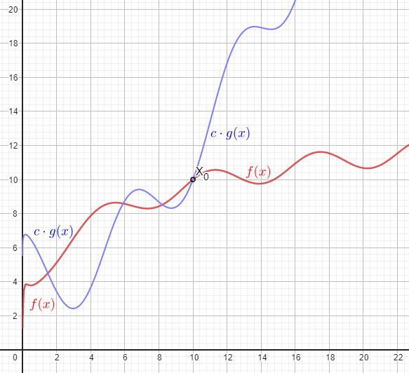
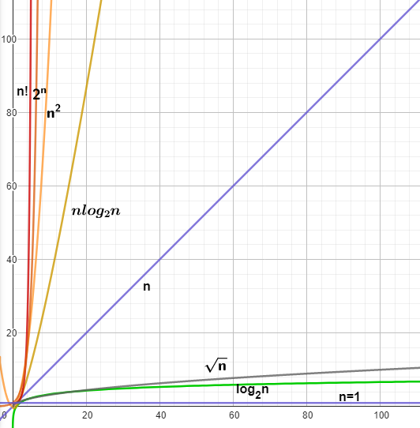
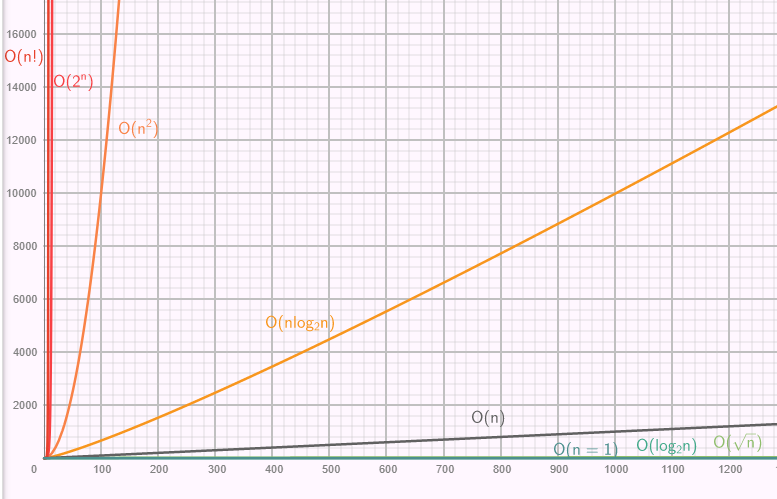

# Comparing Orders of Magnitude

<!-- Notes maintained by: Dibakash Baruah -->

How do we compare functions with respect to orders of magnitude

In order to compare one function against another function we have a notion called upper bound.

---

## Upper Bound (Big O of a function)

---

- $f(x)$ is said to $O(g(x))$ if we can find constants $c$ and $x_0$ such that $c \cdot g(x)$ is an upper bound for $f(x)$ beyond $x_o$

  > $f(x)$ is said to $O(g(x))$ ( Big O of g(x) ) if in some sense the function $g(x)$ sits above $f(x)$. Now, as we are ignoring constants, (and order of magnitude is what matters to us ) we are allowed to make $g(x)$ sit above $f(x)$ by multiplying g(x) by some suitable constants.
  >
  > This might not happen for small values of $n$ as in the case of $n^3 >, =, < 5000.n^2$.
  >
  > So, basically we need to find out two values $x_o$ and $c$ such that if we go beyond $x_o$ then $f(x)$ is below $c \cdot g(x)$

- Mathematically it can be represented as,
  > $f(x)\le c.g(x), \space \forall  \space x \ge x_o$

<figure>
  </img>
  <figcaption>fig 1: upper bound of a graphs</figcaption>
</figure>

 

Here are some graphs that we discussed before. both $\log n$ and $\sqrt n$ doesn't grow very fast. Here we can say $\sqrt n$ is an upper bound for $\log n$

<figure>
  </img>
  <figcaption>fig 2: BigO comparison</figcaption>
</figure>

For small value of $n$, $n\log n$ looks like it is closer to $n^2$ like the above image however we can observe that it is actually much closer to $O(n)$ than it is to $n^2$ as n approaches some large value as shown in the fig 3 below.

<figure>
  </img>
  <figcaption>fig 3: BigO comparison with large n</figcaption>
</figure>
'
