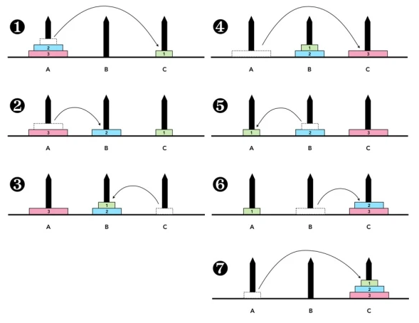

# Calculating Complexity - Examples

<!-- Notes maintained by: Dibakash Baruah -->

Typically there will be two types of code that we look at.

- **Iterative Programs**
- **Recursive Programs**

## Iterative Programs Example

---

### Example 1: Find the maximum element in a list:

- The input size is the length of the list
- Single loop scans all elements
- Always takes n steps
- Overall time is $O(n)$

This has worst-case $O(n)$ but in some sense it is in every case $O(n)$

```
def maxElement(L):
    """Finds the maximum element in a list
    Args:
        L (list): list of elements

    Returns:
        int: max element in the list
    """
    maxval = L[0]
    for i in range(len(L)):
        if L[i] > maxval:
            maxval = L[i]
    return maxval
```

  <br>

### Example 2: Check whether a list contains duplicates

- The input size is the length of the list
- Nested loops scan all the pairs of elements
- A duplicate may be found in the very first iteration (best scenario)
- Worst case - no duplicates. In other words, both loops run fully
- Time is $(n-1)+(n-2)+...+1 = {n(n-1)\over 2}$
- Overall time is $n^2$.
- (We are looking at the worst-case)

```
def noDuplicates(L):
    """Check whether a list contains duplicates

    Args:
        L (list): list
    """
    for i in range(len(L)-1):
        for j in range(i+1,len(L)):
            if L[i] == L[j]:
                return True
    return False

```

  <br>

### Example 3: Matrix Multiplication

- Matrix is represented as a list of lists

  $$\left[ 1 \ 2 \ 3 \atop 4 \ 5 \ 6\right]$$

  $$[[1,2,3],[4,5,6]]$$

- Output matrices have size $m \times p$
- Three nested loops
- Overall time is $O(mnp)$, and $O(n^3)$ if both matrices are $n \times n$

```
from pprint import pprint


class incompatibleMatrices(Exception):
    def __str__(self):
        return "Matrices are not compatible. Check inputs"
    pass

def matrixMultiply(A, B):
    try:
        if len(A[0]) != len(B):
            raise incompatibleMatrices

        m, n, p = len(A), len(B), len(B[0])

        C = [[0] * p for _ in range(m)]

        for i in range(m):
            for j in range(p):
                for k in range(n):
                    C[i][j] += A[i][k] * B[k][j]

        return C

    except incompatibleMatrices:
        print("matrices are not compatible, check input")

```

 <br>

### Example 4: Number of bits in the binary representation of $n$

- $\log n$ steps for $n$ to reach 1
- For number theoretic problems, the input size is the number of digits.

  > (Number theoretic problems are problems that involve the properties and behavior of numbers, particularly integers. These types of problems can include questions about the divisibility of numbers, the distribution of primes, and the solution of Diophantine equations (equations where the solutions are required to be integers). Examples of number theoretic problems include Goldbach's Conjecture, Fermat's Last Theorem, and the Riemann Hypothesis. Number theory is an active area of mathematical research and many number theoretic problems remain unsolved.)

- The algorithm is linear in the input size

```
def numberOfBits(n):
    count = 1

    while n > 1:
        count += 1
        n //= 2

    return count
```

note:

> - To find the number of digits in the binary representation of $n$, we keep dividing $n$ by 2 and we get each bit as we go along till we reach 1.
>
> - In other words, the number of times it takes to halve $n$ down to 1 which is basically $\log n$
>
> - For a list type of input, where the input is of size $n$, a function which takes order of $\log n$ would be considered very efficient.
>
> - But, for number theoretic problems like above we should not consider $n$ as the input size itself. We should rather look at how much space it requires to write down $n$, which is roughly the number of digits in $n$
>
> - We are saying that the number of digits is proportional to $\log n$ and the output is taking $\log n$ to compute. So, this is actually a linear function. (Even though it seems like it is taking $\log n$ time, $\log n$ itself is the size of the input.)
>
> - One thing we have to realize is that we might be writing it in decimal and taking it out in binary. i.e. we are considering $\log _{10} n$ as input and output as $\log _2 n$. It is not difficult to see that these two are connected by a constant factor. Because, $\log$ of any $n$ to any base, is order of $\log$ of $n$ to any other base. So, we can say this is in order $O(\log _2 n)$. The input is in base 10, i.e. the size is the number of digits written in decimal and the output is logarithmic to base 2; but they are of both of same order of magnitude.

Description:

> - It is important to consider the base of the logarithm. For example, if we are working with the logarithm of a number in base 10 (written as $\log_{10}n$), it is equivalent to working with the logarithm of the same number in base 2 (written as $\log_{2}n$) by dividing $\log_{10}n$ by $\log_{10}2$ (a constant factor), and therefore have the same order of magnitude. This means that regardless of whether the input is written in base 10 or base 2, the output will be logarithmic to base 2 and will be of the same order of magnitude.
>
> - The concept related to this is the logarithm change of base formula. It states that for any two positive number bases $a$ and $b$, and for any positive number $x$, the following equation holds:
>
> - $\log _a x = {\log _b x \over \log _b a}$
>
> - $\log _2 n = {1  \over \log _{10} 2}\cdot \log _{10} n$
>
> - This formula allows us to convert logarithms from one base to another, which is useful when working with different bases or when comparing the order of magnitude of logarithms with different bases.
>
> For example, if we have an algorithm that has a time complexity of $O(\log _{10}n)$, we can use the logarithm change of base formula to convert it to $O(\log _{2}n)$ by dividing $\log _{10}n$ by $\log _{10}2$ and we'll get the same order of magnitude, $O(\log _{2}n)$, and it's more common to use $\log _2 n$ in the analysis of algorithm complexity.
>
> In other words, the base of the logarithm does not change the order of magnitude of the logarithm, so it's more convenient to use a base that has more common usage $\log _2 n$

## Recursive Program Example

---

### Example 5: Towers of Hanoi

The Towers of Hanoi is a classic puzzle game that consists of three rods and a number of disks of different sizes that can slide onto any rod. The puzzle starts with the disks in a neat stack in ascending order of size on one rod, the smallest at the top, thus making a conical shape.

The objective of the puzzle is to move the entire stack to another rod, obeying the following simple rules:

- Only one disk can be moved at a time.
  Each move consists of taking the upper disk from one of the rods and sliding it onto another rod, on top of the other disks that may already be present on that rod.

- No disk may be placed on top of a smaller disk.

<figure>
  </img>
  <figcaption>fig. l31: Towers of Hanoi</figcaption>
</figure>

- Three pegs - A, B, C
- Move n disks from A to B, Use C as a transit peg
- Never put a larger disk on a smaller one

Recursive solution

- Move $n - 1$ disks from A to C, and use B as the transit peg
- Move large disk from A to B
- Move $n - 1$ discs from C to B, and use A as the transit peg

When we have a recursive solution like this, the best way to express the complexity is to think of it as a recursive formulation or a recurrence.

Recurrence

- $M(n)$ - the number of moves to transfer n disks
- $M(1) =1$

  > If we have only one disk to move we can always move it, i.e. we can move the top disk from a pile of 3 disks.
  >
  > $\therefore M(1)=1$

- $M(n) = M(n-1) + 1 + M(n-1) = 2M(n-1) + 1$

  > 1. Move $n-1$ disks from A to C i.e $M(n-1)$
  >
  > 2. Move 1 disk from A to B
  >
  > 3. Move $n-1$ disks from C to B i.e $M(n-1)$
  >
  > 4. Total: $2M(n-1) + 1$

  This basically gives a recursive dependence of $M(n)$ on $M(n-1)$

The usual way to solve this is to expand or unwind the recurrence by substituting.

- Unwind and solve

  1. Start with

     > $M(n) = 2M(n-1) + 1$

  2. Expand in a recursive manner
     > $M(n) = 2M(n-1) + 1$
     >
     > $= 2(2M(n-2)+1) + 1$
     >
     > $= 2^2 M(n-2)+ (2 + 1)$
     >
     > $= 2^2 (2M(n-3)+1)+ (2 + 1)$
     >
     > $= 2^3 M(n-3)+ (4+ 2 + 1)$
     >
     > $...$
     >
     > $= 2^k M(n-k) + (2^k - 1)$
     >
     > $...$
     >
     > $= 2^{n-1} M(n-(n-1))+ (2^{n-1} - 1)$
     >
     > $= 2^{n-1} M(1)+ (2^{n-1} - 1)$
     >
     > $= 2^{n-1} + 2^{n-1} - 1$
     >
     > $= 2^{n} - 1$

The complexity of the Tower of Hanoi problem is measured by the number of moves required to solve the puzzle. This is calculated using the recursive formula: $T(n) = 2^n - 1$, where n is the number of disks. This means that for n disks, it takes 2^n - 1 moves to solve the puzzle.

The time complexity of the Tower of Hanoi problem is $O(2^n)$, which is exponential. This means that as the number of disks increases, the number of moves required to solve the puzzle increases exponentially. This makes the problem computationally expensive and impractical for large numbers of disks.

In conclusion, the Tower of Hanoi is a classic puzzle game with a simple rule set but a complex solution that becomes exponentially more difficult as the number of disks increases. Its time complexity is $O(2^n)$ which is exponential.

## Summary

- Iterative Programs

  > Focus on loops
  >
  > If we are looking at iterative programs with loops then what we need to understand is that how many time the loops execute
  >
  > If there are no loops then the program just takes constant amount of steps. But any interesting program usually consists of loops.
  >
  > "For loops" are easy to calculate but for "While loops" we have to be a bit careful to calculate how many times it executes for the while to become 1.

- Recursive Programs

  > Write and solve recurrence

- Need to be clear about accounting for "basic" operations
  > Even though this is a flexible notion, we have to careful
  >
  > E.g. A hidden function call inside a loop whose cost may not be a basic step.
